# Android MVVM Sample
使用[玩Android](https://www.wanandroid.com) 接口，基于 [RxJava 2](https://github.com/ReactiveX/RxJava/tree/2.x)（主要用于代替`LiveData`）和 官方 [Architecture Component](https://developer.android.com/topic/libraries/architecture)构建的`MVVM`示例程序（同时是一个完整的非官方的`Android`版应用），编程语言是`Kotlin`（自定义控件部分使用的是`Java`）

## 编译与运行
下载并导入到`Android Studio`：
```
git clone https://github.com/vejei/android-mvvm-sample.git
```

签名信息参见`debug_keystore.properties`文件

## 依赖
* [JUnit 4](https://github.com/junit-team/junit4)
* [Mockito](https://github.com/mockito/mockito)
* [Truth](https://github.com/google/truth)
* [Robolectric](https://github.com/robolectric/robolectric)
* [Espresso](https://developer.android.com/training/testing/espresso)
* [Room](https://developer.android.com/training/data-storage/room)
* [Material Components for Android](https://github.com/material-components/material-components-android)
* [FlexboxLayout](https://github.com/google/flexbox-layout)
* [Dagger](https://github.com/google/dagger)
* [EasyPermission](https://github.com/googlesamples/easypermissions)
* [OSS Licenses Gradle Plugin](https://github.com/google/play-services-plugins/tree/master/oss-licenses-plugin)
* [Timber](https://github.com/JakeWharton/timber)
* [RxJava2](https://github.com/ReactiveX/RxJava/tree/2.x)
* [RxAndroid](https://github.com/ReactiveX/RxAndroid/tree/2.x)
* [Retrofit](https://github.com/square/retrofit)
* [Retrofit Gson Converter](https://github.com/square/retrofit/tree/master/retrofit-converters/gson)
* [Retrofit RxJava2 Adapter](https://github.com/square/retrofit/tree/master/retrofit-adapters/rxjava2)
* [Glide](https://github.com/bumptech/glide)
* [CircleImageView](https://github.com/hdodenhof/CircleImageView)
* [RxBinding](https://github.com/JakeWharton/RxBinding)
* [CarouselView](https://github.com/vejei/CarouselView)
* [ViewPagerIndicator](https://github.com/vejei/ViewPagerIndicator)

## 运行截图
||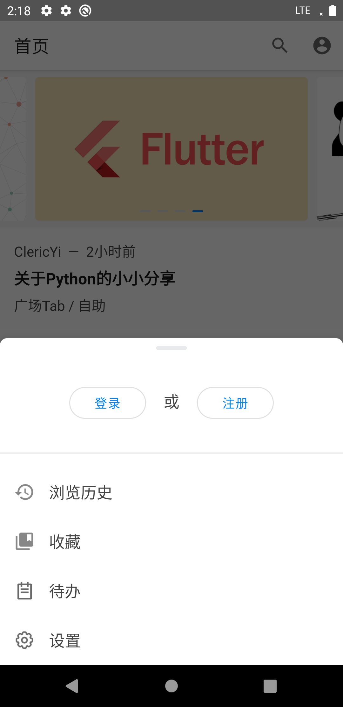|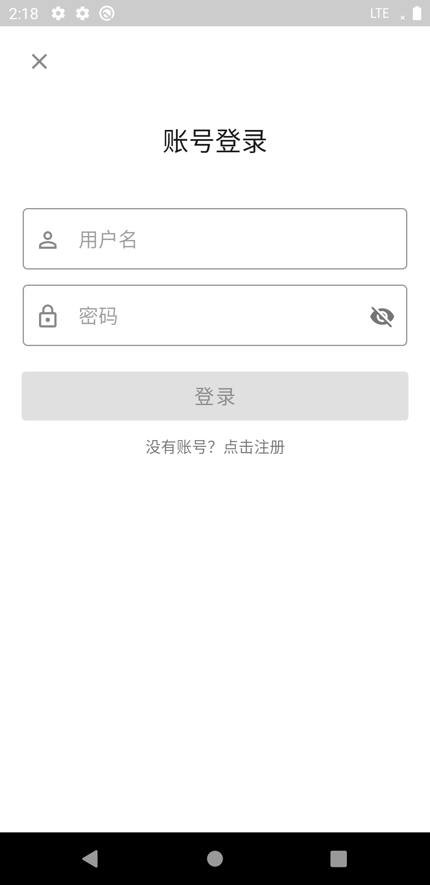|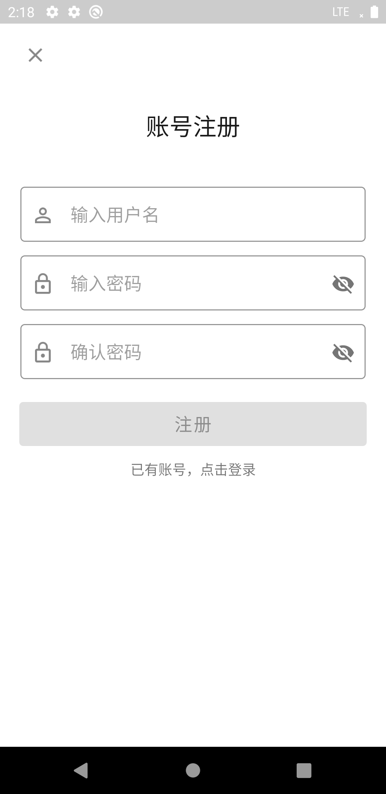|
|----|----|----|----|
||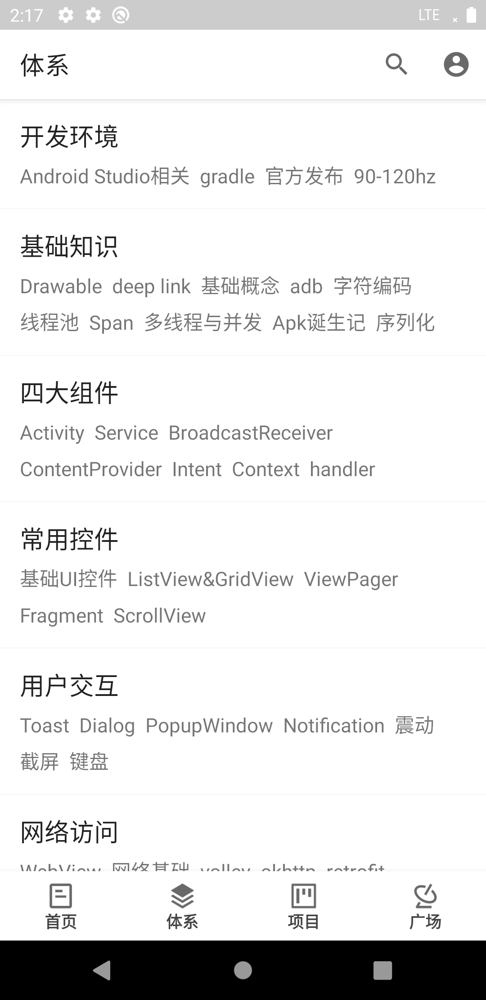|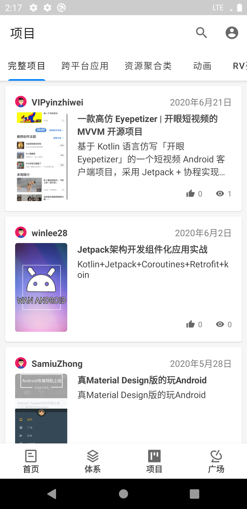|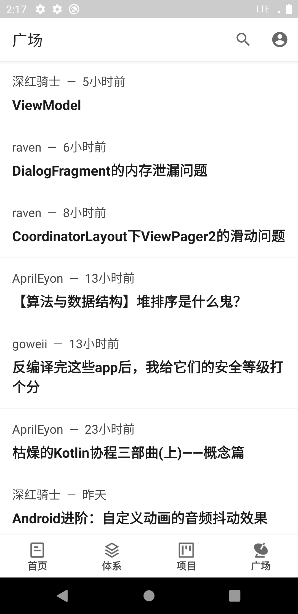|
|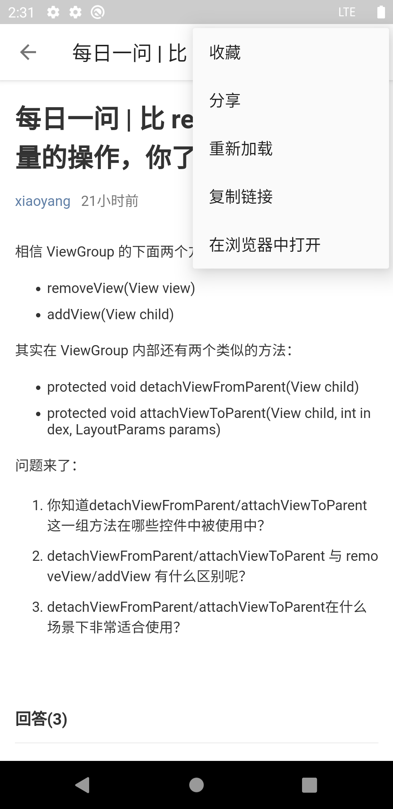|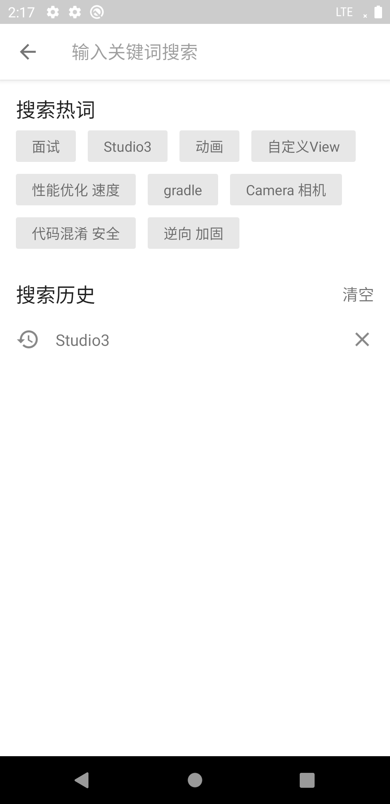|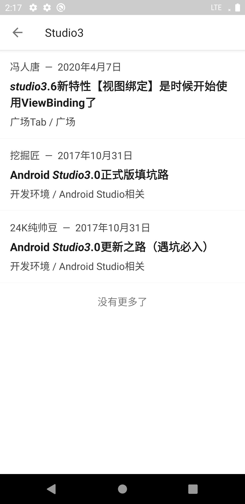|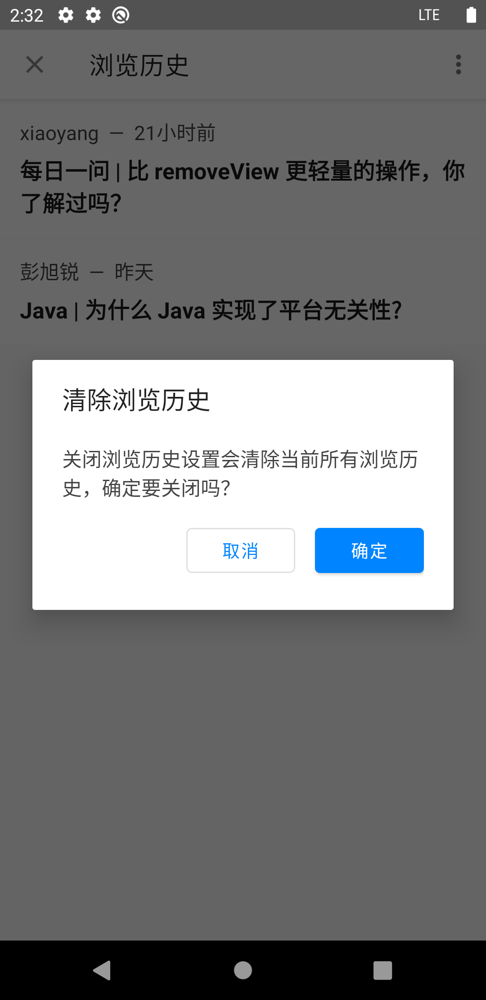|
|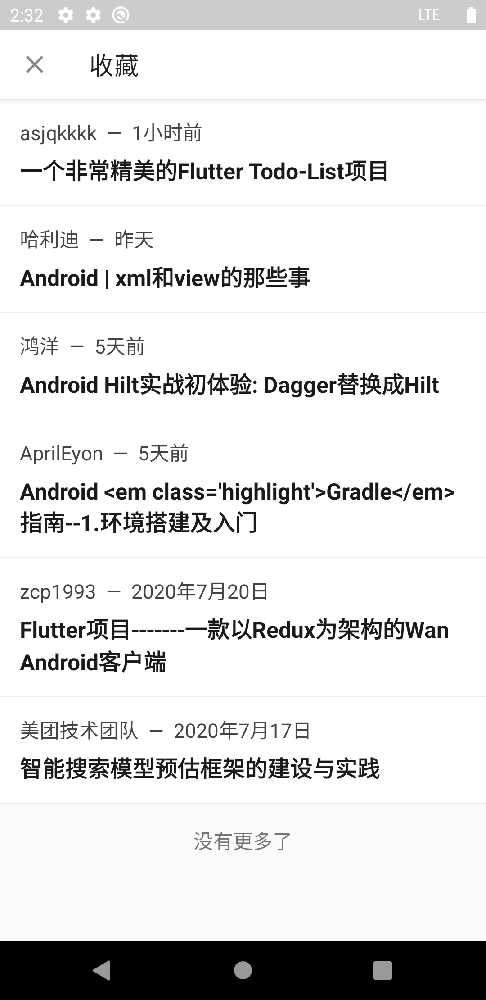|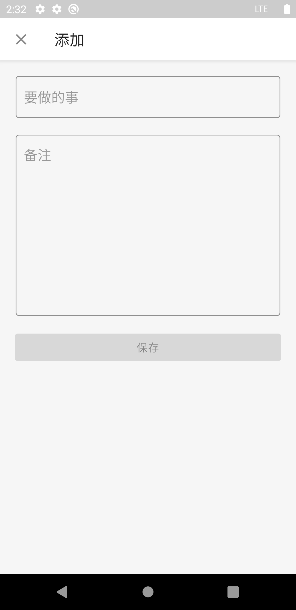|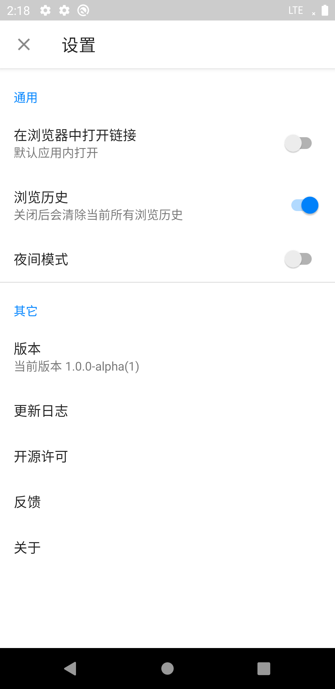|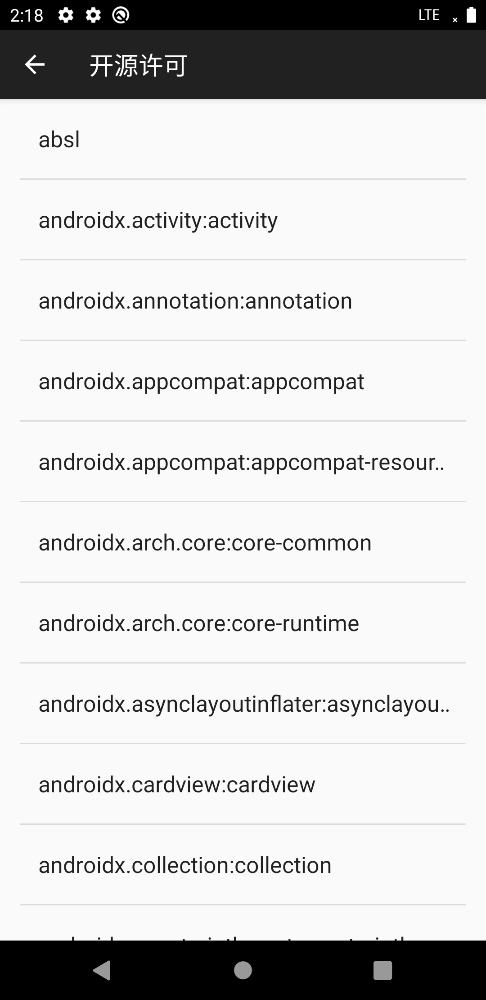|
